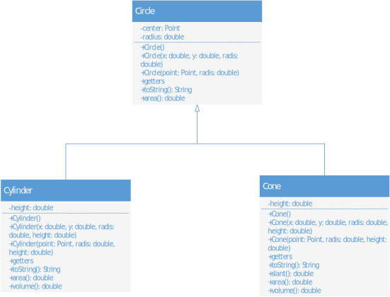

### Pete vježbe, prvi zadatak
Slika 1. predstavlja UML dijagram na kojem su prikazane klase `Circle` i izvedene klase `Cylinder` i `Cone`. Realizovati ove tri klase u potpunosti, vodeći računa o tome da su svi podaci članovi i metode prikazani na slici. Oznake – i + ispred podataka i metoda označavaju privatno i javno pravo pristupa, respektivno.  
Statički podatak `totalArea` klase `Circle` sadrži informaciju o površini svih kreiranih objekata (krugova, valjaka i kupa). Voditi računa o tome da se površine objekata mogu mijenjati tokom izvršenja programa.  
Prilikom setovanja visine, povesti računa da unijeta vrijednost mora biti pozitivna. U suprotnom, baciti izuzetak tipa `IllegalArgumentException`.  
Kreirati klasu `Application` koja će testirati prethodno kreirane klase. Testiranje klasa podrazumijeva kreiranje bar po 2 instance klasa `Circle`, `Cylinder` i `Cone`, i pozivanje realizovanih metoda.  
Ilustrovati downcasting na primjeru jedne instance klase `Circle`, jedne instance klase `Cylinder` i metode zapremina.  
Konačno, reference na sve kreirane objekte smjestiti u jedan niz krugovi, proći kroz taj niz i odštampati zapremine svih valjaka i kupa.

<figure>

<figcaption align = "center"><b>Slika.1 UML dijagram</b></figcaption>
</figure>