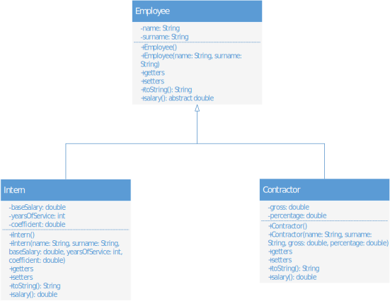

### Pete vježbe, prvi zadatak
Slika 1. predstavlja UML dijagram na kojem su prikazane klase `Employee` i izvedene klase `Intern` i `Contractor`. Realizovati ove tri klase u potpunosti, vodeći računa o tome da su svi podaci članovi i metode prikazani na slici. Oznake – i + ispred podataka i metoda označavaju privatno i javno pravo pristupa, respektivno.  
Uočiti da je metoda `salary` kod klase `Employee` apstraktna.  
Plata radnika stažiste se računa kao:  
`salary = baseSalary * coefficient * (1 + yearsOfService/50)`  
dok se plata radnika na procenat računa kao:  
`salary = percentage * gross`  
Pri pokušaju unosa negativne osnovice, staža ili koeficijenta, baciti izuzetak tipa `IllegalArgumentException`.  
Kreirati klasu `Application` koja će testirati prethodno kreirane klase. Testiranje klase podrazumijeva kreiranje bar po 3 instance klasa `Intern` i `Contractor`, i pozivanje realizovanih metoda.  
Konačno, reference na sve kreirane objekte smjestiti u jedan niz, proći kroz taj niz, odrediti ukupan iznos plata radnika stažista i radnika na procenat. Odštampati dobijene iznose.

|  | 
|:--:| 
| *Slika.1 UML dijagram* |

